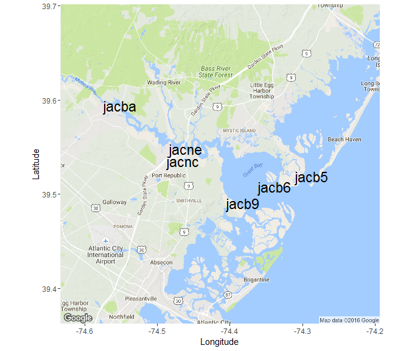
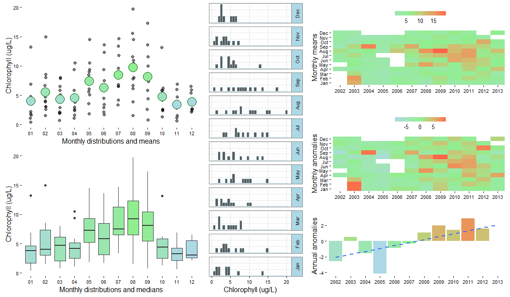

# SWMPr cookbook
Marcus W. Beck, beck.marcus@epa.gov, Todd D. O'Brien, todd.obrien@noaa.gov  
Oct. 25, 2015  


# Introduction

test test test

This document provides a collection of instructions and scripts that perform specific tasks for working with SWMP data in R using the SWMPr package.  It provides scripts that use functions from SWMPr, as well as many others available in the base or contributed R packages.  This cookbook is meant to provide participants with a 'go-to' document that builds on content covered in the workshop.  Much of the content can be a considered a basic approach to time series analysis and we encourage the exploration of alternative, more specific methods that are available in R.  Please see the CRAN task view on [time series](http://cran.r-project.org/web/views/TimeSeries.html) for an idea of what is possible.  The data used in these scripts have been included with the SWMPr package installation, excluding the first few scripts that are provided only as templates for your own use.  Please feel free to contact the instructors with questions regarding this cookbook or general questions about time series analysis in R.  We encourage any feedback regarding these documents or the content of the workshop.

The SWMPrats website provides additional resources to assist with the analysis of SWMP data, including links to Workshop content: [http://swmprats.net](http://swmprats.net)

# Basics of R and RStudio

The simplest approach to managing data and scripts for individual projects is to use an RStudio project.  The project includes a self-contained directory that is automatically set as the working directory where all scripts and data are located.  The workspace history can also be saved and loaded automatically when using the project.  Aside from these benefits, RStudio projects facilitate reproducibility by improving the ability to share code and datasets between users.  A new project can be created from RStudio under the File menu by selecting `New project...'.  Additional information can be found [here](https://support.rstudio.com/hc/en-us/articles/200526207-Using-Projects).  The remainder of this section describes a workflow for analysis not using an RStudio project, either from RStudio directly or the standard R command console.  

## What to do when you start a new session in R

You will need to follow a few simple steps to use data and functions in R if you are starting a new session.  Here is a basic workflow of these steps.

- Open a new or saved script that you will use to type code (.r file extension).  This is under the File menu on the top for both the basic R install and RStudio.

- Load R packages that you will use.  The functions in a package will not be available unless the package is loaded.  The package must also be previously installed (see below for package installation).  You can put the packages you are using at the top of your script.

- Set the working directory.  This is where R will load and save files.

- Load any workspace that you were using previously.  This an R specific file format (.RData) that contains any and all objects that were in a previous workspace.  Ideally, you will have saved a workspace from your previous session.

Here is a sample script of this workflow.


```r
# my startup script

# load any installed packages
library(SWMPr)
library(ggplot2)

# set the working directory
# change as needed
setwd('C:/my_files')

# load your previous workspace if you saved one
# this must be in the working directory, otherwise use full path
load(file = 'my_workspace.RData')

# check what you loaded
ls()
```

Other data formats can also be imported or loaded into R.  Flat text files or comma-separated files are commonly used, although R can import many other types.  Use the following functions to import text or csv data.  Don't forget to assign your data to an object.


```r
# import data and assign
# data are in the working directory, or use a full path

# import a csv file
dat <- read.csv('my_data.csv', header = T)

# importa a text file, separated by commas
dat <- read.table('my_data.txt', header = T, sep = ',')
```

## What to do when you close a session

Make sure you save your work when you close a session!  The most important thing to save is the script since this will include all code to import and manipulate data.  Saving data is less important if it can be reproduced on-the-fly using the script.  Save the script you're working with using the File menu at the top.  You may also want to save your data.  Just as data of different types can be imported, data can also be saved in different formats.  You will either want to save the whole workspace or individual parts (e.g., a data.frame as a .csv file).  


```r
# save the whole workspace as a .RData file
# will be saved in the working directory
save(list = ls(), file = 'my_workspace.RData')

# save one object (e.g., dat) as a .RData file
save(dat, file = 'my_data.RData')

# save as .csv
write.csv(dat, 'my_data.csv')

# save as text file
write.table(dat, 'my_data.txt', sep = ',', row.names = F, quote = F)
```

## Installing packages

R installs and loads packages from its library on your computer.  You can see where your library is with `.libPaths()`.  Packages that you install from CRAN or elsewhere will go in this library.  R will also look here when you load a package to see if it is installed.  Most packages will be downloaded from CRAN, although you can also download packages from Github or BioConductor.  In the latter case, you will have to first download and load the devtools package off CRAN.  Again, you will have to load a previously installed package every time you start R if you want to use its functions.  You should only have to download a package once, unless you want to re-install to get the latest version.  Here are some basics for installing and loading a package.   


```r
# install a package from CRAN
install.packages('ggplot2')

# install packages from Github
install.packages('devtools')
library(devtools)
install_github('fawda123/SWMPr')
library(SWMPr)
```

## Keyboard shortcuts

You can view all the keyboard shortcuts in RStudio by clicking on Help, then keyboard shortcuts on the top menu.  Here are some common shortcuts for Windows/Linux (* denotes RStudio only). 

*CTRL+ENTER* run selection * 

*CTRL+R* run selection 

*CTRL+L* clear console 

*CTRL+A* select all 

*CTRL+C* copy 

*CTRL+X* cut 

*CTRL+V* paste 

*CTRL+O* open document 

*CTRL+S* save document 

*CTRL+1* switch to source * 

*CTRL+2* switch to console * 

*ESC* stop current execution 

*HOME* skip to beginning of line 

*END* skip to end of line

## Getting help

If all else fails, a Google search will usually point you in the right direction. All of the documentation that comes with R and its packages are available online.  A quick search for a function or package will lead you to the documentation. You can also access the help files on your computer in R.


```r
# access a help file for a function
help(mean)

# or do this
?mean

# run the examples in the help file
example(mean)
```

# Using the SWMPr package

Each of the functions in SWMPr are built around a standard workflow to retrieve, organize, and analyze SWMP data.  Help files for functions in each of the categories can be searched for using their alias tags:


```r
help.search('retrieve', package = 'SWMPr')
help.search('organize', package = 'SWMPr')
help.search('analyze', package = 'SWMPr')
```
 
Help files for individual functions can also be searched using the standard `?foo` syntax.  Note that the help file for some SWMPr functions can only be found by using the full method name in the search, e.g., `?subset.swmpr` to find the `?subset` help file for the `swmpr` object method.  This only occurs for functions that are already available in R but have methods for `swmpr` objects included in the SWMPr package.  Otherwise, only the generic function name needs to be searched, e.g., `?aggreswmp` and not `?aggreswmp.swmpr`.  

## A quick workflow for retrieving and organizing

Each of the functions in the SWMPr package usually have default values for the arguments to make their use easier.  However, be cautious since the default values may not be applicable for your specific dataset.  Always consult the help documentation to determine the best options for importing and organizing your data.  The following examples provide  generic workflows for importing and organizing data that you have downloaded from CDMO.  The `import_local` function is meant to work with data from the [Zip Downloads](http://cdmo.baruch.sc.edu/aqs/zips.cfm) service from the CDMO.  Data included with the SWMPr installation are used for the remainder of this document, starting with the second example under 'multiple files'.  Also note that you must assign the data to an object to save results returned from functions (i.e., using `<-`).      

### Single file

This shows how to import and organize data for a single station that you downloaded.  Note that files can also be imported from the compressed directory if the .zip extension is provided in the path.


```r
# import data for apaebmet that you downloaded

# this is an example path with hypothetical csv files
# change as needed for actual data
path <- 'C:/my_path'

# import, qaqc, subset to remove empty columns
dat <- import_local(path, 'apaebmet')
dat <- subset(qaqc(dat), rem_cols = T)
```

Data included in SWMPr can be loaded using the `data` function.  They can also be loaded on the fly by calling their object names directly within a function.  The available datasets include several years of observations from nutrient, water quality, and weather stations at the Apalachicola Bay reserve.  The full metadata are provided in the help files for each.  The data are included for use with examples in the help files for the main package functions.


```r
# see available datasets
data(package = 'SWMPr')

# load
data(apacpnut)
data(apacpwq)
data(apadbwq)
data(apaebmet)

# help files describing each dataset
?apacpnut
?apacpwq
?apadbwq
?apaebmet
```

### Multiple files

This shows how to import and organize multiple stations that you downloaded in the same request. 


```r
# import data for multiple stations

# this is an example path with hypothetical csv files
# change as needed for actual data
path <- 'C:/my_path/'

# import, combine, qaqc, subset to remove empty columns
wq_dat <- import_local(path, 'apacpwq')
nut_dat <- import_local(path, 'apacpnut')
met_dat <- import_local(path, 'apaebmet')
dat <- comb(wq_dat, nut_dat, met_dat)
dat <- subset(qaqc(dat), rem_cols = T)
```

The remainder of this cookcook will use data from muliple files that were imported and organized in the following script.  These are the example data included with the SWMPr package.


```r
# combine datasets that come with SWMPr
# qaqc and subset to remove empty columns
dat <- comb(apacpwq, apaebmet)
dat <- subset(qaqc(dat), rem_cols = T)
```

## Viewing the attributes and subsets of the data

The imported SWMPr data are assigned to a `swmpr` object class.  A `swmpr` object is a `data.frame` for the raw data and a `list` of several descriptive attributes.  The attributes are useful metadata describing the raw data and are also used internally within SWMPr functions to keep track of information.


```r
# names of all the attributes
names(attributes(dat))

# examples of retrieving attributes
attr(dat, 'station')
attr(dat, 'parameters')
attr(dat, 'qaqc_cols')
attr(dat, 'date_rng')
attr(dat, 'timezone')
```

Viewing the whole dataset is often impractical.  Here are some functions for viewing subsets.


```r
# View the first 1000 rows
View(dat)

# first six rows, last six rows
head(dat)
tail(dat)

# first n rows, last n rows
head(dat, 30)
tail(dat, 30)

# single variables
dat$do_mgl
dat[, 'do_mgl']

# column 1
dat[, 1]

# row 1
dat[1, ]

# row 1, column 1
dat[1, 1]

# dimensions
dim(dat)
nrow(dat)
ncol(dat)
length(dat)
```

## Simple numerical summaries

Numerical summaries of the data can be obtained for the entire dataset or single variables.  In some cases, you will have to explicitly specify how missing data are handled.  For example, the default behavior of many functions is to return `NA` if missing values are in the data.  See the examples for how to change this behavior.


```r
# whole dataset
summary(dat)

# individual variables
summary(dat$do_mgl)

# mean, range, var, etc.
# note use of na.rm
mean(dat$do_mgl, na.rm = T)
range(dat$do_mgl, na.rm = T)
var(dat$do_mgl, na.rm = T)
sd(dat$do_mgl, na.rm = T)
min(dat$do_mgl, na.rm = T)
max(dat$do_mgl, na.rm = T)

# how many missing values?
sum(is.na(dat$do_mgl))
```

## Aggregating or reducing data volume

The SWMPr package provides several functions for reducing the volume of data.  This is useful for not only making the data more manageable, but also providing summary statistics that potentially describe trends.

The subset function lets you select columns or rows of interest.


```r
# select two parameters from dat
subset(dat, select = c('rh', 'bp'))

# subset records greater than or equal to a date
subset(dat, subset = '2013-01-01 0:00', operator = '>=')

# subset records within a date range
subset(dat, subset = c('2012-07-01 6:00', '2012-08-01 18:15'))

# subset records within a date range, select two parameters
subset(dat, subset = c('2012-07-01 6:00', '2012-08-01 18:15'),
  select = c('atemp', 'temp'))

# remove rows/columns that do not contain data
subset(dat, rem_rows = T, rem_cols = T)
```

The setstep function lets you change the time step of your data.


```r
# change to two hour steps
setstep(dat, timestep = 120)
```

Aggreswmp is used to summarize data by set periods of observations.  The `aggs_out` argument can be set to `TRUE` to create boxplot summaries of data combined by aggregation periods (see below).


```r
# aggregate DO by quarters using the mean (default)
aggreswmp(dat, by = 'quarters', params = c('do_mgl'))

# change the default function, aggregate by months
fun_in <- function(x) var(x, na.rm = T)
aggreswmp(dat, by = 'months', FUN = fun_in, params = c('do_mgl'))
```

The smoother function is a simple moving window average that can be used to reduce the variance in a parameter.  This may help to characterize a trend.


```r
# subset the data to smooth
sub_dat <- subset(dat, subset = c('2012-07-09 00:00', '2012-07-24 00:00'))

# smooth DO using a window of 50 observations
smooth_dat <- smoother(sub_dat, window = 50, params = 'do_mgl')
```

## Dealing with missing data

Missing data can be handled several ways depending on the needs of an analysis.  The following example shows how to replace missing data with the mean value of the whole time series, omit all missing values, or interpolate using `na.approx`.  This is not an exhaustive list of options.  


```r
# subset for the example
sub_dat <- subset(dat, subset = c('2013-01-22 00:00', '2013-01-26 00:00'))

# replace with mean

# a temporary object so we don't overwrite wq_dat
wq_tmp <- sub_dat

# replace with the mean
wq_tmp <- wq_dat
wq_tmp[is.na(wq_tmp$do_mgl), 'do_mgl'] <- mean(wq_tmp$do_mgl, na.rm = T)

# remove missing values

# using subset function
wq_tmp <- subset(wq_tmp, rem_rows = T)

# use na.omit
wq_tmp <- na.omit(wq_tmp)

# linearly interpolate using na.approx

# interpolate, maxgap of 10 records
wq_tmp <- na.approx(sub_dat, params = 'do_mgl', maxgap = 10)

# interpolate maxgap of 30 records
wq_tmp <- na.approx(sub_dat, params = 'do_mgl', maxgap = 30)
```

# Graphics

Graphics are virtually limitless in R.  The base installation provides several functions that will suit most of your needs.  The ggplot2 package is also very useful for plotting by following a syntax built around a `grammar of graphics'.  The following are simple scripts showing how various plots can be made using base graphics and ggplot2.

## Base graphics

Simple time series plots.


```r
# subset dat for the example
sub_dat <-  subset(dat, subset = c('2012-07-09 00:00', '2012-07-24 00:00'))

# plot with points
plot(do_mgl ~ datetimestamp, data = sub_dat)
```

 

```r
# plot with lines
plot(do_mgl ~ datetimestamp, data = sub_dat, type = 'l')
```

 

```r
# changing the default arguments, add points to graph
plot(do_mgl ~ datetimestamp, data = sub_dat, type = 'l', col = 
    'orange', xlab = '', ylab = 'Dissolved oxygen (mg/L)',
  cex.axis = 0.8, bty = 'n')
points(sub_dat$datetimestamp, sub_dat$do_mgl, pch = 16, cex = 0.5)
```

 

Multiple plots in the same window.


```r
# it is often useful to open a new plot window, uncomment and run the next line
# windows()

# create three plots in the same window
# 3 rows one column, use mfrow argument with par
par(mfrow = c(3, 1))
plot(do_mgl ~ datetimestamp, data = sub_dat, type = 'l')
plot(temp ~ datetimestamp, data = sub_dat, type = 'l')
plot(atemp ~ datetimestamp, data = sub_dat, type = 'l')
```

 

Diagnostics plots.


```r
# subset for the example
sub_dat <- subset(dat, select = c('sal', 'temp', 'do_mgl'), 
  subset = c('2013-08-01 0:0', '2013-08-15 0:0'))

# pairs plot
# a pairs plot is a matrix of bivariate scatterplots
# caution, this plot may take a while to load for large datasets
pairs(sub_dat)
```


```r
# histograms
hist(sub_dat$sal, xlab = 'Salinity', main = 'Histogram')
```


```r
# boxplots
# must remove datetimestamp
to_plo <- data.frame(sub_dat)[, -1]
boxplot(to_plo)
```


A boxplot of aggregation results.


```r
# aggregate by DO by seasons/quarters
to_plo <- aggreswmp(dat, by = 'quarters', params = 'do_mgl', 
  aggs_out = T)

# plot
boxplot(do_mgl ~ datetimestamp, data = to_plo, ylab = 'DO (mg/L)')
```


## Plotting with ggplot2

The ggplot2 package offers many plotting features that are incredibly useful .  We present some examples here to illustrate plotting multiple variables on the same scale.


```r
# install ggplot2, should be installed with SWMPr
install.packages('ggplot2')

# install the reshape2 package for formatting data before plotting
install.packages('reshape2')
```

A multivariate time series plot with ggplot2.


```r
# subset for the example
sub_dat <-  subset(dat, subset = c('2012-07-09 00:00', '2012-07-24 00:00'),
  select = c('do_mgl', 'atemp', 'temp'))

# load relevant packages
library(ggplot2)
library(reshape2)

# prepare data for plotting
to_plo <- melt(sub_dat, id.var = 'datetimestamp')

# plot
p <- ggplot(to_plo, aes(x = datetimestamp, y = value)) +
  geom_line() + 
  facet_wrap(~ variable, ncol = 1, scales = 'free_y') + 
  theme_bw()
p
```

 

Using aggregation and ggplot2 to plot multiple variables.


```r
# aggregate by season
agg_dat <- aggreswmp(dat, by = 'quarters', 
  params = c('do_mgl', 'temp', 'atemp'), aggs_out = T)

# prepare data for plotting
to_plo <- melt(agg_dat, id.var = 'datetimestamp')

# plot
p <- ggplot(to_plo, aes(x = factor(datetimestamp), y = value)) +
  geom_boxplot() + 
  facet_wrap(~ variable, ncol = 1, scales = 'free_y') + 
  theme_bw() +
  theme(axis.text.x = element_text(size = 5))
p
```

 

## Plotting functions in SWMPr

The `map_reserve` function uses the ggmap package to create a plot of the stations at a reserve.  The ggmap package should install and load automatically when you use SWMPr. You will have to play with the `zoom` argument as the spatial extent varies at each reserve. 


```r
map_reserve('jac', zoom = 11)
```

 

Create a summary plot using `plot_summary` in SWMPr.  This plot is a multi-panel collection of ggplot objects that can be used to quickly evaluate a variable over time.


```r
# summary plot using the nutrient data
plot_summary(apacpnut, 'chla_n')
```

 

The `overplot` function can plot more than one variable on the same axis.  


```r
# plot multiple variables on the same axis
overplot(dat, select = c('do_mgl', 'temp'),
 subset = c('2013-01-01 0:0', '2013-02-01 0:0'), lwd = 2)
```

 

Time series decomposition can be accomplished with `decomp` or `decomp_cj`.  Both are similar and return a plot of decomposed time series from the original.


```r
# decompose the chlorophyll time series
decomp_cj(apacpnut, param = 'chla_n')
```

 

## Saving graphics

A graphic can be saved in different formats using the file menu in the plot window, or using the Export option in RStudio.  You can also save graphics using specific commands that are run in the console.  The following shows how to save a graphic as a png or png file.


```r
# save a png graphic, will go to the working directory
# height, width in inches
png('my_plot.png', height = 6, width = 6, units = 'in', res = 300)

# ggplot graphic from earlier
p

# turn off the graphics device
dev.off()

# save a png
# height, width in pixels, res in ppi
png('my_plot.png', height = 2400, width = 2400, res = 400)

# ggplot graphic from earlier
p

# turn off the graphics device
dev.off()
```
